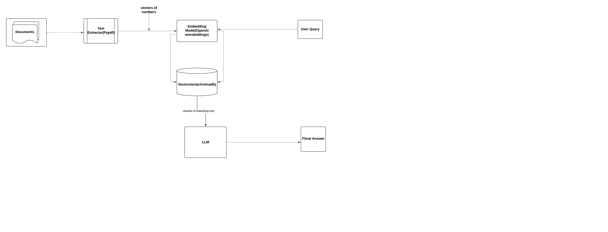

# Full Stack Django App: Chatbot with Custom Knowledge Base

## Project Description

This project is a full-stack Django application with an HTML-based user interface. It allows users to train chatbots with custom knowledge bases built from uploaded PDF documents. Users can then interact with the chatbot to get answers based on the trained knowledge base. The project leverages **RAG (Retrieval-Augmented Generation)** and **LangChain** for chatbot training and response generation, with **Chroma DB** as the vector store for storing document embeddings.

---

## Features

### 1. Upload Training Docs

- Allows users to upload documents in PDF format.
- These documents are used to train the bot.

### 2. Train the Bot

- Initiates the training process to create a custom knowledge base from the uploaded documents.

### 3. Chat

- Provides a chat interface where users can ask questions based on the trained knowledge base.

### 4. Your Documents

- Displays the list of uploaded documents.
- Allows users to delete documents as needed.

### 5. Reset Knowledge

- Clears the existing knowledge base.
- Users can retrain the bot with new documents.

---

## System Design

Below is the system diagram for the project:



---

## Getting Started

### Prerequisites

Ensure you have the following installed:

- Python (>= 3.8)
- Django (>= 4.0)
- pip

### Steps to Clone and Run the Project

1. **Clone the Repository**

   ```bash
   git clone <repository-url>
   cd <repository-directory>
   ```

2. **Create a Virtual Environment**

   ```bash
   python -m venv venv
   source venv/bin/activate # On Windows: venv\Scripts\activate
   ```

3. **Install Dependencies**

   ```bash
   pip install -r requirements.txt
   ```

4. **Apply Migrations**

   ```bash
   python manage.py migrate
   ```

5. **Run the Development Server**

   ```bash
   python manage.py runserver
   ```

6. **Access the Homepage**
   Open your browser and navigate to:
   ```
   http://127.0.0.1:8000/process-docs-page/
   ```

---

## Project Structure

- **Navbar Links**:

  - **Upload Training Docs**: Upload your PDF documents.
  - **Train the Bot**: Train the chatbot using the uploaded documents.
  - **Chat**: Interact with the chatbot based on the trained knowledge base.
  - **Your Documents**: Manage your uploaded documents.
  - **Reset Knowledge**: Clear and reset the knowledge base.

- **Backend**:
  - Utilizes Django+DjangoRestFramework for handling routes, file uploads, and processing.
  - Integrates **Chroma DB** as a vector store for embedding storage.
  - Uses **LangChain** for chatbot logic and RAG-based training.
  - Utilizes **OpenAI embeddings** model and **ChatOpenAI** as the LLM model

---

## Additional Notes

- Update your `.env` file with necessary credentials (OpenAI API key to use OpenAI embeddings).
- For production, configure your static files, database, and other settings appropriately.

---

## License

This project is licensed under the [MIT License](LICENSE).

Feel free to contribute or raise issues in the repository!
